# 🚨 Afet Yönetim Sistemi

Mobil tabanlı **Afet Yönetim Sistemi**, afet anlarında yöneticiler ile gönüllüler arasındaki koordinasyonu güçlendirmek amacıyla geliştirilmiş Flutter tabanlı bir mobil uygulamadır.


---

# 📌 Proje Hakkında

Afet anlarında iletişim eksikliği, koordinasyon sorunları ve görev dağılımındaki gecikmeler ciddi problemlere yol açmaktadır.

Bu proje;

- Afet bölgelerinin oluşturulması
- Gönüllülerin konumlarının belirlenmesi
- Yakındaki gönüllülere anlık bildirim gönderilmesi
- Görev atama işlemleri
- Acil durum yönetimi
- Harita tabanlı takip
- Eğitim içeriklerinin sunulması

işlemlerini tek bir mobil uygulama üzerinden gerçekleştirmektedir.

---

# 🎯 Temel Özellikler

✅ Kullanıcı kayıt ve giriş sistemi

✅ Firebase Authentication

✅ Yönetici Paneli

✅ Gönüllü Paneli

✅ Afet oluşturma

✅ Afet listeleme

✅ Görev atama sistemi

✅ Acil yardım bildirimi

✅ Firebase Cloud Messaging

✅ Konum tabanlı gönüllü belirleme

✅ Google Maps entegrasyonu

✅ Profil yönetimi

✅ Eğitim modülü

✅ Bildirim sistemi

---

# 🏗 Kullanılan Teknolojiler

| Teknoloji | Açıklama |
|------------|----------|
| Flutter | Mobil uygulama geliştirme |
| Dart | Programlama dili |
| Firebase Authentication | Kullanıcı doğrulama |
| Cloud Firestore | Veritabanı |
| Firebase Cloud Messaging | Bildirim sistemi |
| Firebase Functions | Sunucu tarafı işlemler |
| Google Maps API | Harita ve konum işlemleri |

---

# 📂 Proje Yapısı

```text
lib/
│
├── screens/
│   ├── login_screen.dart
│   ├── register_screen.dart
│   ├── home_screen.dart
│   ├── admin_dashboard.dart
│   ├── volunteer_home_screen.dart
│   ├── map_screen.dart
│   ├── emergency_alert_screen.dart
│   ├── notification_screen.dart
│   ├── profile_screen.dart
│   └── ...
│
├── main.dart
```

---

# 📱 Uygulama Ekranları

## 🔐 Kullanıcı İşlemleri

| Giriş Ekranı | Kayıt Ekranı |
|---|---|
| 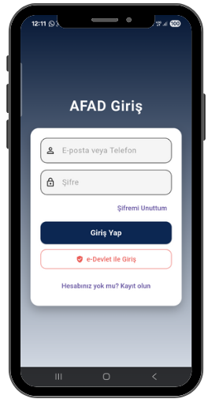 | 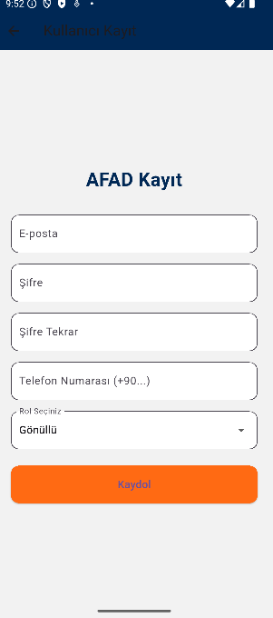 |

---

## 👨‍💼 Yönetici İşlemleri

| Yönetici Paneli | Afet Bildirimi Oluşturma |
|---|---|
| 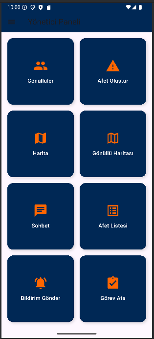 | 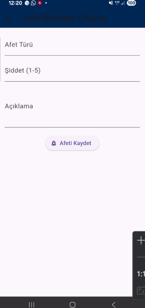 |

---

## 🚨 Afet ve Bildirim Yönetimi

| Acil Durum Bildirimi | Bildirimler |
|---|---|
| 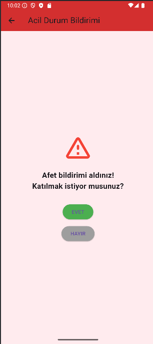 | 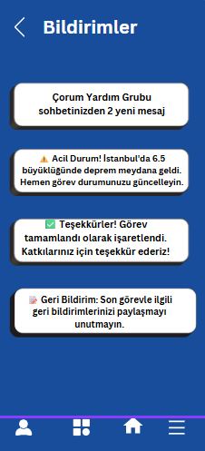 |

---

## 🗺️ Konum ve Görev Takibi

| Gönüllü Takip Haritası | Görev Atama |
|---|---|
| 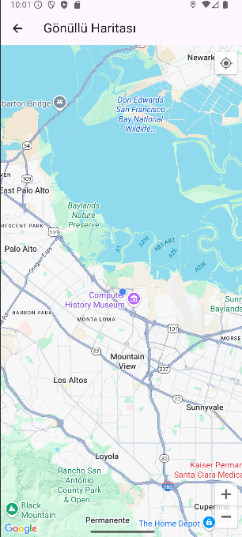 | 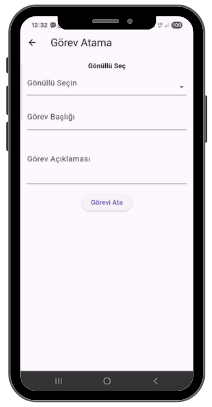 |

---

## 💬 İletişim ve Kullanıcı Alanları

| Sohbet Ekranı | Profil Ekranı |
|---|---|
| 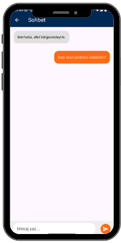 | 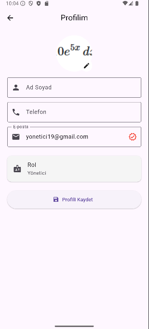 |

---

## 📍 Ek Modüller

| Konum İzni | Menü |
|---|---|
| 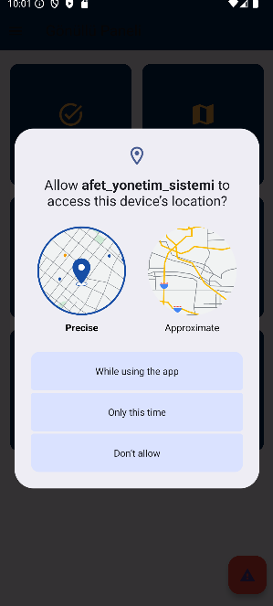 | 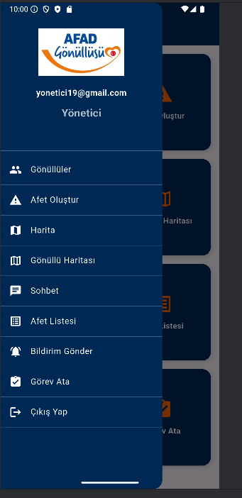 |

---

# ⚙ Kurulum

Repository'yi klonlayın.

```bash
git clone https://github.com/sule-ozt/afet_yonetim_sistemi.git
```

Proje klasörüne girin.

```bash
cd afet_yonetim_sistemi
```

Gerekli paketleri yükleyin.

```bash
flutter pub get
```

Projeyi çalıştırın.

```bash
flutter run
```

---

# 🚀 Gelecekte Yapılması Planlananlar

- Grup sohbet sistemi
- Yapay zekâ destekli gönüllü önerisi
- Offline çalışma desteği
- Çoklu dil desteği
- Afet istatistik ekranı
- Web yönetim paneli

---

# 👨‍💻 Geliştirici

**Şule Öztürk**

Bilgisayar Mühendisliği/Bitirme Projesi

Hitit Üniversitesi

---

# 📄 Lisans

Bu proje eğitim ve akademik çalışmalar kapsamında geliştirilmiştir.